# [记录于 B 站珠峰培训](https://www.bilibili.com/video/BV1WX4y1u7GB?from=search&seid=3827761445669523720)

# 浏览器是多进程的

- 浏览器进程: 负责页面展示、用户交互、子进程管理、提供存储等。
- GPU 进程: 3D 绘制 硬件加速提高体验。
- 插件进程:
- 渲染进程: 每个页卡都有单独的渲染进程，核心用于渲染页面
  - GUI 渲染线程
  - js 引擎线程
  - 事件触发线程
- 网络进程: 处理网络资源加载

CRP:关键渲染路径
57，60，61

# 1 URI(URL)解析

- 域名 -> ip
- 地址解析
  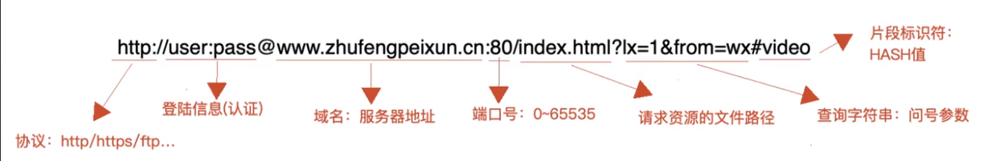

# 2 \*DNS 解析（DNS 服务器）

- 第一次 DNS 解析预计时间 20-120ms
- 如果之前解析过，会在本地有缓存（不一定）
- DNS 查询：递归查询（本地）和 迭代查询
  - 递归查询（本地）  
    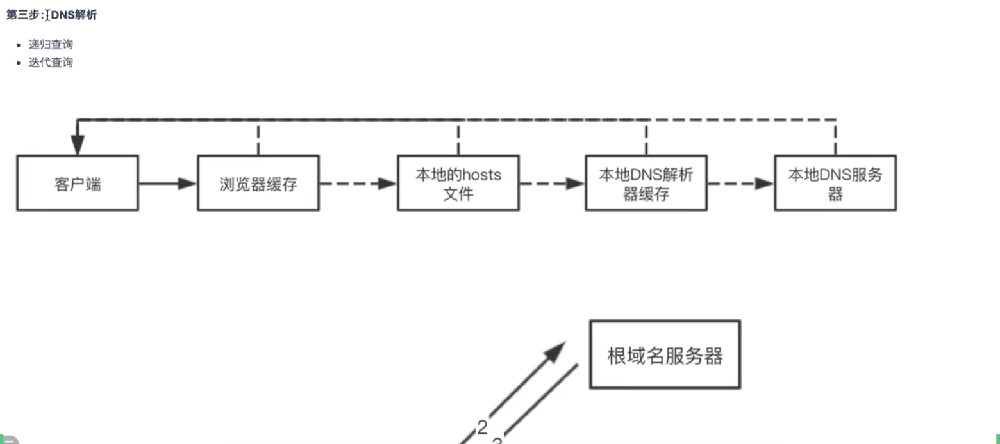
  - 迭代查询
    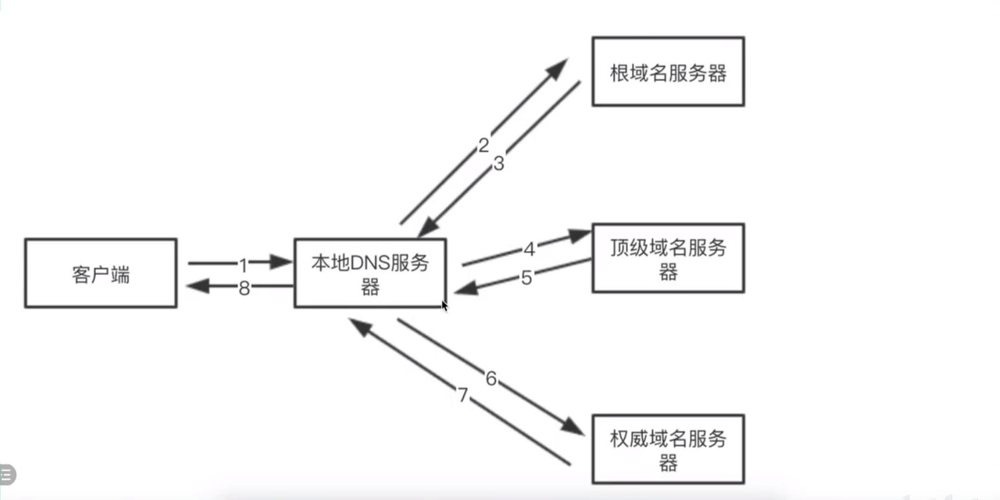

> DNS 优化
>
> - 减少 DNS 请求（一个页面中尽可能少用不同的域名，资源放在相同服务器上。真实项目不这么做，会把不同资源放不同服务器上）
> - DNS 预获取（DNS Prefetch）
>
> ```html
> <link rel="dns-prefetch" href="//img14.360buyimg.com" />
> <link rel="dns-prefetch" href="//img20.360buyimg.com" />
> <link rel="dns-prefetch" href="//img30.360buyimg.com" />
> <link rel="dns-prefetch" href="//d.3.cn" />
> ```

# 3 TCP 三次握手，建立客户端和服务器端的链接通道

- tcp:是一种传输控制协议,是面向连接的、可靠的、基于字节流之间的传输层通信协议,由 IETF 的 RFC 793 定义
- 标记符号  
  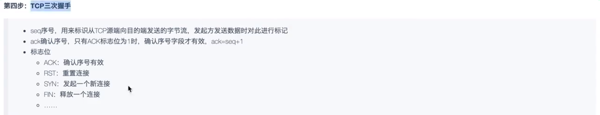
- 握手过程  
  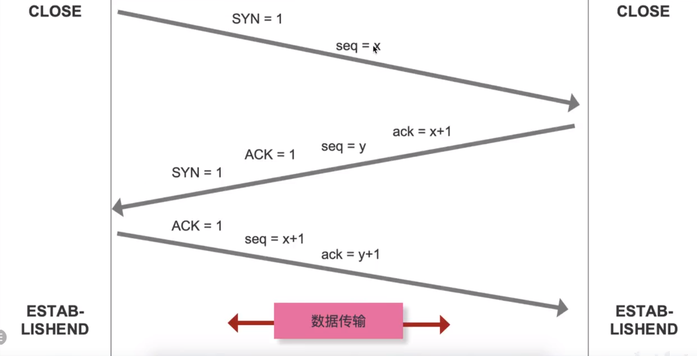

# 4 发送 HTTP 请求

# 5 服务器处理和响应

# 6 TCP 的四次挥手：关闭客户端和服务器端的链接通信

- 标记符号意义在 3 次握手里有
- 挥手过程  
   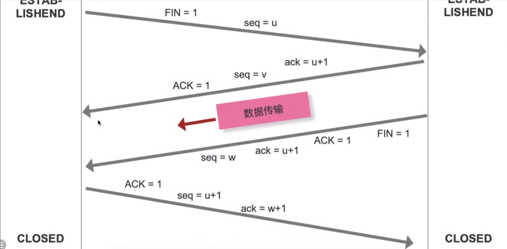
  > http1.0:需要手动设置 Connection:keep-alive 让 tcp 连接不关闭  
  > http1.1:默认不关闭
  > 长链接一般在页面关闭时释放，很少会通过服务器主动关闭

# 7 \*浏览器解析渲染

## 第一步 生成 DOM tree

Bytes -> characters -> Tokens -> Nodes -> DOM

- Bytes:类似 3c 2e 6f 79 ..在内存中的字节码(之后比如通过 utf-8 解析成字符)
- Characters：<html><head>...</head><body>..
- Tokens : start

1. 转换 ：bytes -> characters 内存编码到字符集
2. 令牌 ：characters -> Tokens 根据 w3c 标准生成
3. 转换 ：Tokens -> Nodes 根据 W3C 标准生成词法解析，生成具体标记结构(此时结构之间的关系以及确认好了)
4. DOM 构建 ：Nodes -> DOM 生成有标签、结构、层级的 DOM 树
   > 前端优化 ：
   >
   > 1. 标签语义化：也就是标签是 w3c 规定的，降低 token 令牌和词法解析的时间
   > 2. 避免多级嵌套：这样 DOM 树的结构不要太深，能解析的更快一些（能少则少，非要一个数值界限就是 3~4 级）

## 第二步 生成 CSSOM tree

解析方式与 DOM tree 一样

> 前端优化 ：
>
> 1. 避免选择器层级嵌套：减少 CSSOM tree 层级
> 2. 使用预编译期要尽量避免层级嵌套，避免编译出的 css 嵌套太深

## 第三步 生成 Render tree

DOM tree 和 CSSOM tree 融合成 Render tree

## 后续

之后根据生成的渲染树计算他们在设备视口内的确切位置和大小，这个计算阶段就是**回流**，根据渲染树及回流信息得到的几何信息，得到节点的绝对像素进行绘制（painting）

# 缓存

先检测是否存在强缓存，有且未失效走强缓存，没有或失效检测是否有协商缓存，有则使用，没有获取新数据

- 缓存位置
  - Memory Cache:内存缓存（页面关闭就没有了）
  - Disk Cache:硬盘缓存

> 打开网页：查找 disk cache 中是否有匹配，如有则使用，如没有则发送网络请求  
> 普通刷新（F5）：因为 TAB 没关闭，因此 memory cache 是可用的，会被优先使用，其次才是 disk cache  
> 强制刷新（Ctrl+F5）:浏览器不使用缓存，因此发送的请求头部均带有 Cache-control：no-cache,服务器直接返回 200 和最新内容

## 强缓存 Expires（http1.0） / Cache-Control（http1.1）

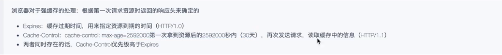
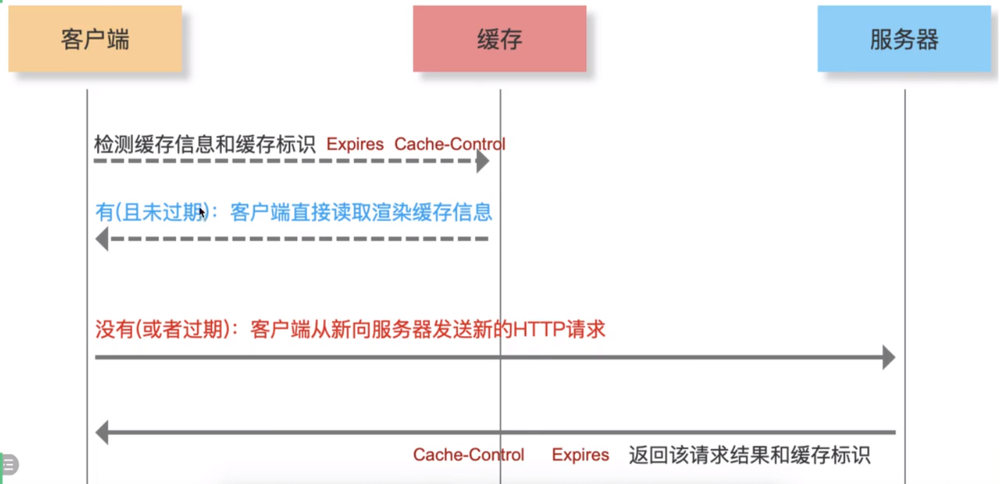
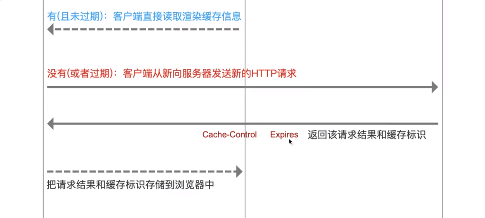

- http 页面一般不做强缓存，每次 html 的请求都是正常的 http 请求。服务器更新志愿后，让资源名和之前不一样，这样页面导入全新的资源。webpack hash.name 就是这样保证文件为最新的
- 文件更新后，我们在 html 导入的时候，设置后缀（时间戳）
  ```html
  <script src="index.js?31232342"></script>
  <script src="index.js?89689998"></script>
  ```

## 协商缓存 Last-Modified（http1.0） / Etag（http1.1）

没有强缓存或其失效后。如果第一次发请求没有协商缓存的话是不会带缓存标识的，因为没有。last-modified 精确到秒，如果一秒内资源更新是识别不出来的
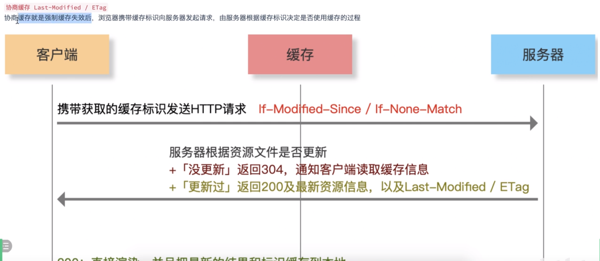
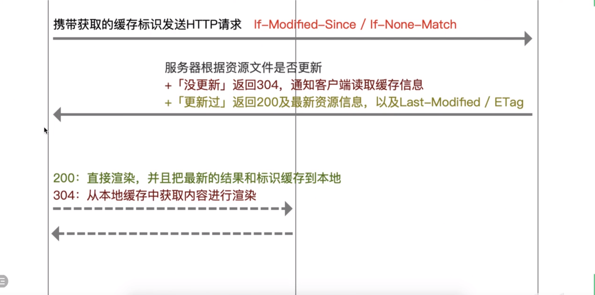

- 第一次发请求  
  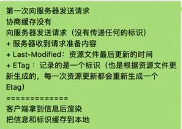
- 第二次发请求  
  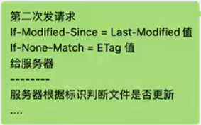

## 强缓存和协商缓存

- 强缓存和协商缓存策略只针对于静态资源
- 协商缓存总会和服务器协商，所以一定会发 http 请求的
- 像是 ajax 获取数据是走不了强缓存和协商缓存的，一般是用 localStorage/vuex/redux

# HTTP1.0,HTTP1.1,HTTP2.0

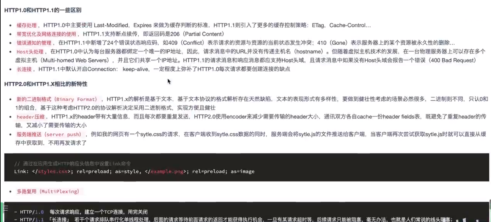

# 补充

> 前端优化 ：
>
> 1. 尽早尽快的把 css 下载到客户端（充分利用 HTTP 多请求多并发机制，chrome 一般可以一次发 6-7 个）
>
> - style
> - link
> - @import
>   放到顶部

- 对 303 的处理则跟原来浏览器对 302 的处理一样（原来浏览器并没有按照 302 的要求那样处理），浏览器对 307 的处理则跟原来 302 所要求的的一样
  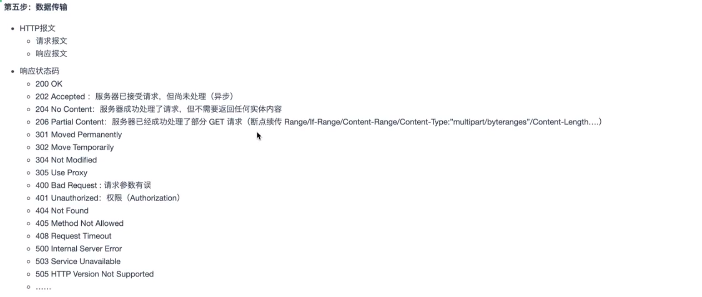
