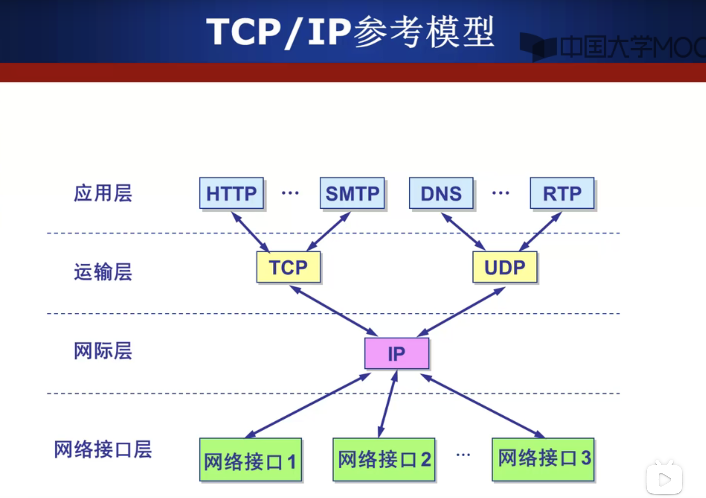

# OSI 参考模型

    OSI - 开放系统互联。
    OSI只是参考模型实际不是按这七层实现的。
    主机需要完成七层，中间系统完成低三次。

- `应用层`
- `表示层`
- `会话层`
- `传输层`
- `网络层`
- `数据链路层`
- `物理层`

# TCP_IP 参考模型

# 五层参考模型

    综合了七层参考模型和 TCP_IP 参考模型.
    源主机和目的主机实现五层，交换机实现低两层，路由器实现低三层。

- `应用层`：支持各种网络应用。
  - FTP、SMTP、HTTP
- `传输层`：进程-进程的数据传输。
  - TCP、UDP
- `网络层`：源主机到目的主机的数据分组路由与转发。
  - IP 协议、路由协议
- `数据链路层`：相邻网络元素（主机、交换机、路由器等）的数据传输
  - 以太网（Ethernet）、802.11（WiFi）、PPP
- `物理层`：比特传输
