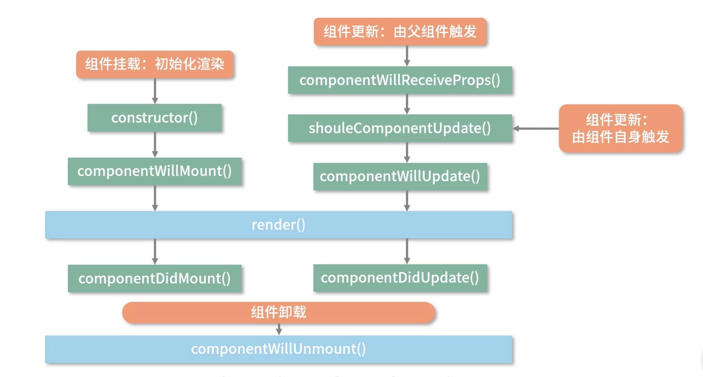
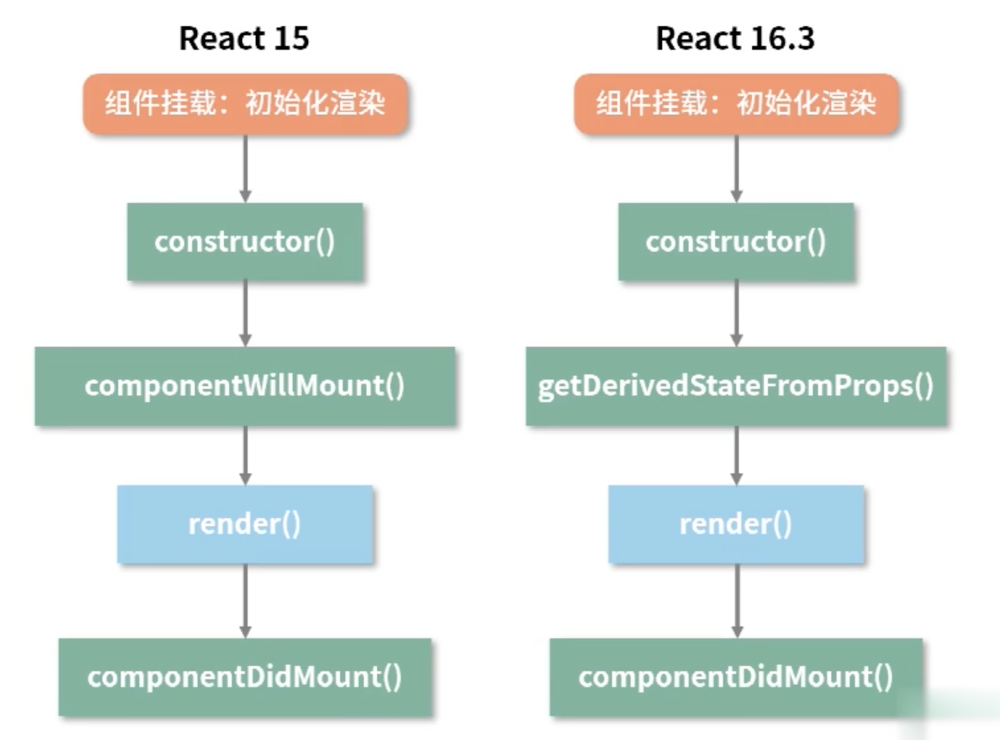
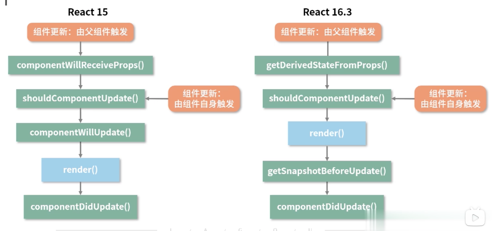
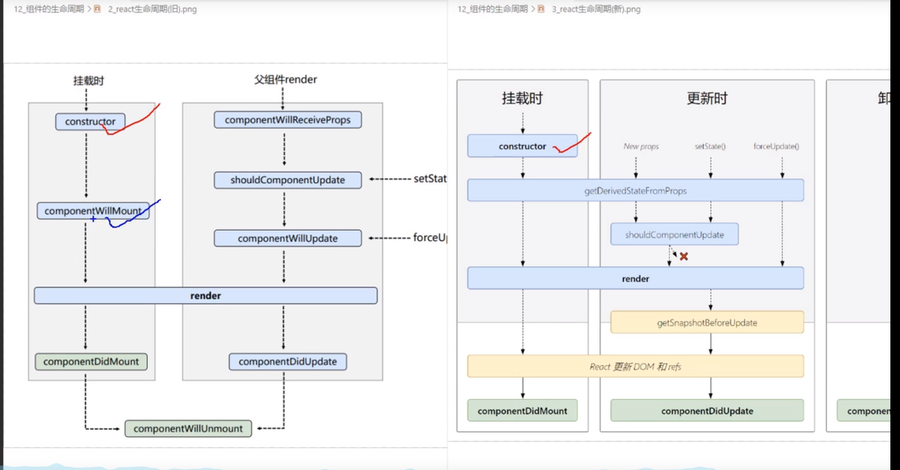

# react 15 生命周期(旧)



# react 15to16 生命周期(新旧对比)




# react 生命周期总结

- `API`
  - shouldComponentUpdate(nextProps,nextState): 返回的 boolean 决定是否执行接下来的生命周期
- `差异(16相比15)`
  - render 函数允许返回数组和字符串，之前必须返回单个元素
  - componentWillMount()被废除而不是代替，添加 getDerivedStateFromProps()。
  - getDerivedStateFromProps(props,state) 是一个静态方法。返回值更新这个组件的 state，这个更新是定向更新而非覆盖式。改函数有且仅有一个目的就是使用 props 派生/更新 state
  - getSnapshotBeforeUpdate(prevProps,prevState) 其返回值回作为第三个参数传给 componentDidUpdate(prevProps,prevState,snapshot)
    

# 虚拟 DOM

    - 虚拟DOM是什么：虚拟DOM是js对象；是关于真实DOM的描述。

# 优化

- shouldComponentUpdate(nextProps,nextState)
- PureComponent + immutable.js
- React.Memo 和 useMemo

```javascript
class A extends Component {}
class B extends PureComponent {}
PureComponent进行的是浅比较;
// 针对组件状态只依赖 props 控制是否要重新渲染整个组件
export default React.Memo(fnComponent, (prevProps, nextProps) => boolean);
// useMemo是否重复执行某一逻辑
const fn = useMemo(() => {});
```
