# [记录于B站珠峰培训](https://www.bilibili.com/video/BV1WX4y1u7GB?from=search&seid=3827761445669523720)
 CRP:关键渲染路径
# 1 URI(URL)解析
- 域名 -> ip
- 地址解析
  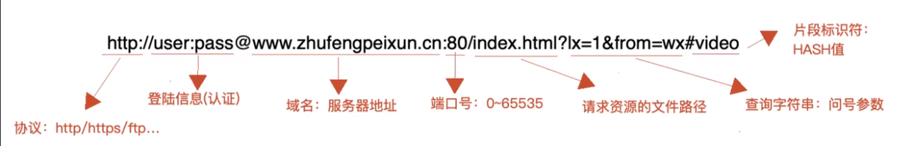
# 2 *DNS解析（DNS服务器）
- 第一次DNS解析预计时间20-120ms
- 如果之前解析过，会在本地有缓存（不一定）
- DNS查询：递归查询（本地）和 迭代查询
  - 递归查询（本地）  
  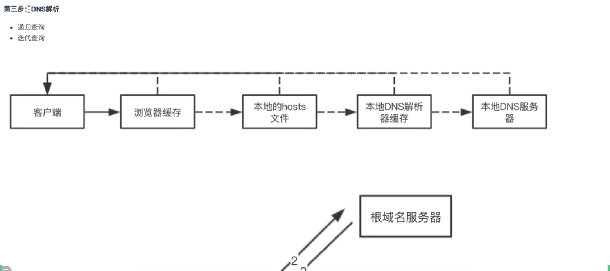
  - 迭代查询
  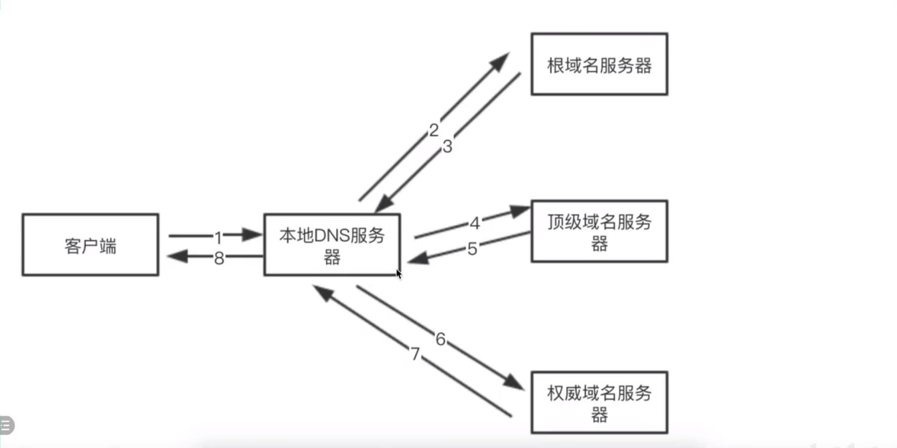

> DNS优化
> - 减少DNS请求（一个页面中尽可能少用不同的域名，资源放在相同服务器上。真实项目不这么做，会把不同资源放不同服务器上）
> - DNS预获取（DNS Prefetch）
> ```html
>   <link rel="dns-prefetch" href="//img14.360buyimg.com">
>   <link rel="dns-prefetch" href="//img20.360buyimg.com">
>   <link rel="dns-prefetch" href="//img30.360buyimg.com">
>   <link rel="dns-prefetch" href="//d.3.cn">
> ```
# 3 TCP三次握手，建立客户端和服务器端的链接通道
- tcp:是一种传输控制协议,是面向连接的、可靠的、基于字节流之间的传输层通信协议,由IETF的RFC 793定义
- 标记符号  
  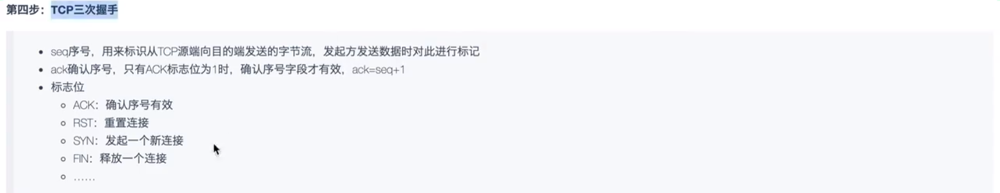 
- 握手过程  
  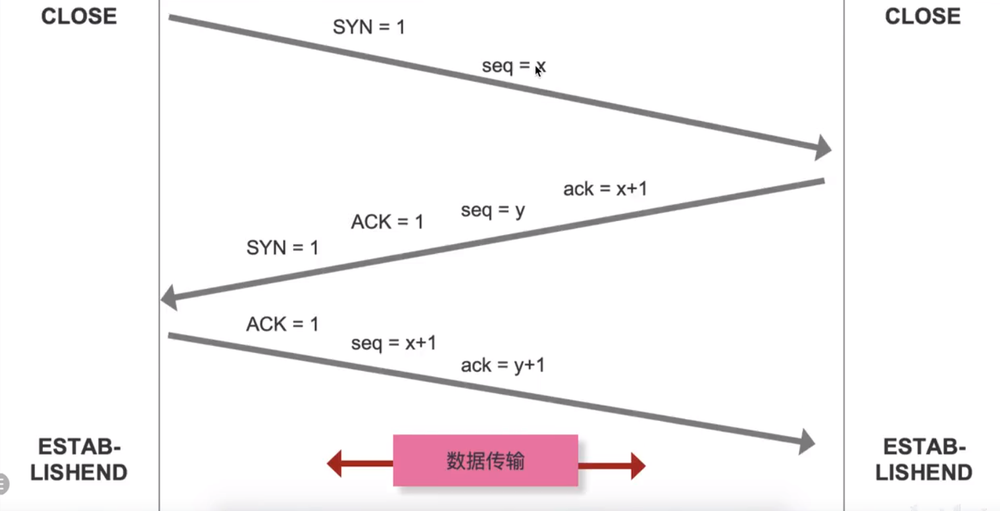 
# 4 发送HTTP请求
# 5 服务器处理和响应
# 6 TCP的四次挥手：关闭客户端和服务器端的链接通信
- 标记符号意义在3次握手里有
- 挥手过程  
  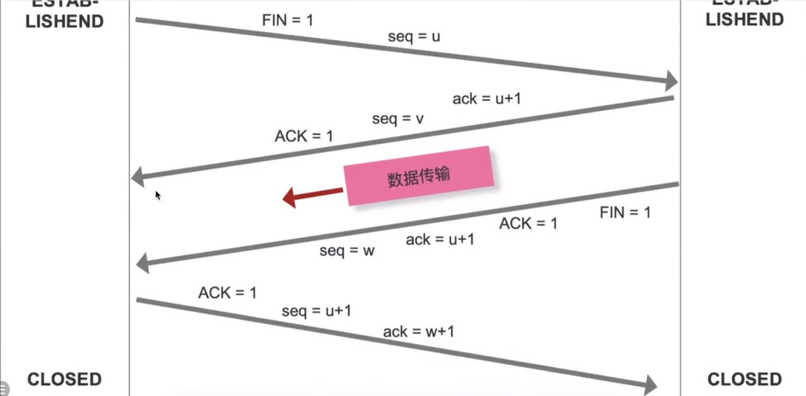 
> http1.0:需要手动设置Connection:keep-alive让tcp连接不关闭  
> http1.1:默认不关闭
> 长链接一般在页面关闭时释放，很少会通过服务器主动关闭
# 7 *浏览器解析渲染
## 第一步 生成 DOM tree
Bytes -> characters -> Tokens -> Nodes -> DOM
- Bytes:类似 3c 2e 6f 79 ..在内存中的字节码(之后比如通过utf-8解析成字符)
- Characters：<html><head>...</head><body>..
- Tokens : start 
1. 转换 ：bytes -> characters内存编码到字符集
2. 令牌 ：characters -> Tokens根据w3c标准生成
3. 转换 ：Tokens -> Nodes根据W3C标准生成词法解析，生成具体标记结构(此时结构之间的关系以及确认好了)
4. DOM构建 ：Nodes -> DOM生成有标签、结构、层级的DOM树
> 前端优化 ：
> 1. 标签语义化：也就是标签是w3c规定的，降低token令牌和词法解析的时间
> 2. 避免多级嵌套：这样DOM树的结构不要太深，能解析的更快一些（能少则少，非要一个数值界限就是3~4级）
## 第二步 生成 CSSOM tree
解析方式与DOM tree一样
> 前端优化 ：
> 1. 避免选择器层级嵌套：减少CSSOM tree层级
> 2. 使用预编译期要尽量避免层级嵌套，避免编译出的css嵌套太深
## 第三步 生成 Render tree
DOM tree 和 CSSOM tree 融合成Render tree
## 后续 
之后根据生成的渲染树计算他们在设备视口内的确切位置和大小，这个计算阶段就是**回流**，根据渲染树及回流信息得到的几何信息，得到节点的绝对像素进行绘制（painting）


# 缓存
先检测是否存在强缓存，有且未失效走强缓存，没有或失效检测是否有协商缓存，有则使用，没有获取新数据
- 缓存位置
  - Memory Cache:内存缓存（页面关闭就没有了）
  - Disk Cache:硬盘缓存

> 打开网页：查找disk cache中是否有匹配，如有则使用，如没有则发送网络请求  
> 普通刷新（F5）：因为TAB没关闭，因此memory cache是可用的，会被优先使用，其次才是disk cache  
> 强制刷新（Ctrl+F5）:浏览器不使用缓存，因此发送的请求头部均带有Cache-control：no-cache,服务器直接返回200和最新内容
## 强缓存 Expires（http1.0） / Cache-Control（http1.1）
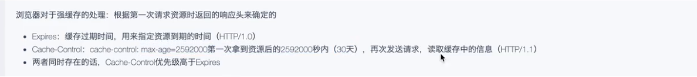
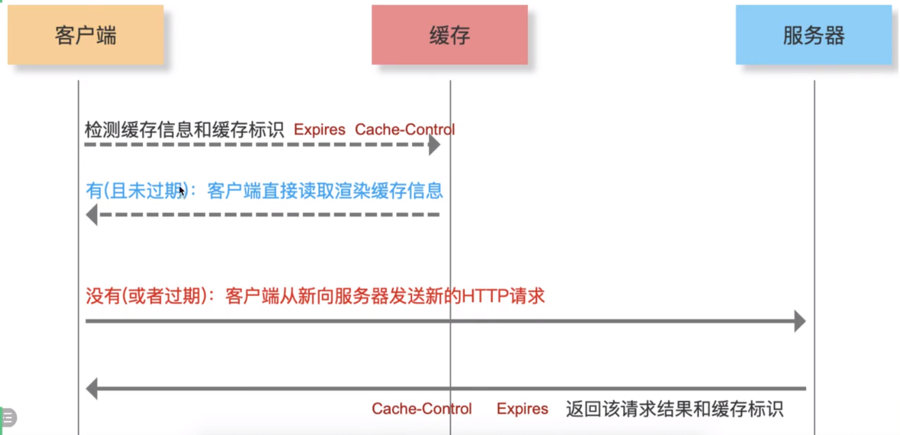
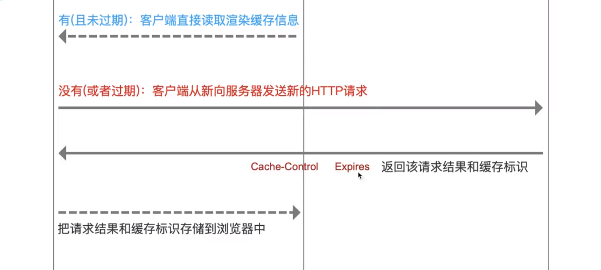
- http页面一般不做强缓存，每次html的请求都是正常的http请求。服务器更新志愿后，让资源名和之前不一样，这样页面导入全新的资源。webpack hash.name 就是这样保证文件为最新的
- 文件更新后，我们在html导入的时候，设置后缀（时间戳）
   ```html
   <script src='index.js?31232342'></script>
   <script src='index.js?89689998'></script>
   ```
## 协商缓存 Last-Modified（http1.0） / Etag（http1.1）
没有强缓存或其失效后。如果第一次发请求没有协商缓存的话是不会带缓存标识的，因为没有。last-modified精确到秒，如果一秒内资源更新是识别不出来的
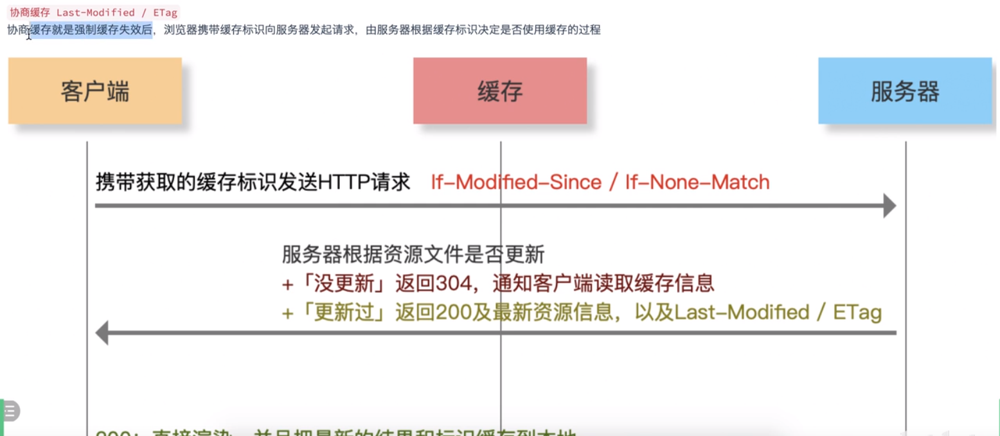
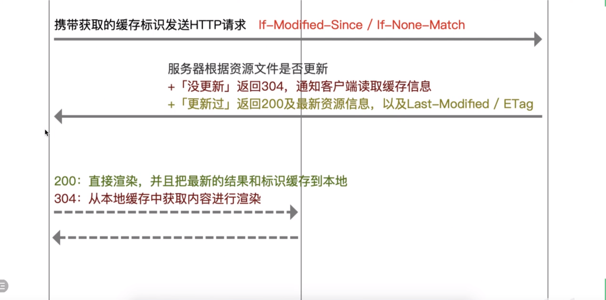
- 第一次发请求  
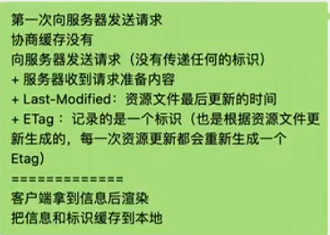
- 第二次发请求  
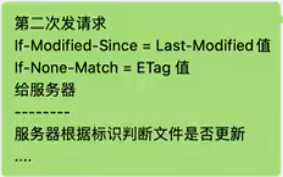
## 强缓存和协商缓存
- 强缓存和协商缓存策略只针对于静态资源
- 协商缓存总会和服务器协商，所以一定会发http请求的
- 像是ajax获取数据是走不了强缓存和协商缓存的，一般是用localStorage/vuex/redux

# HTTP1.0,HTTP1.1,HTTP2.0
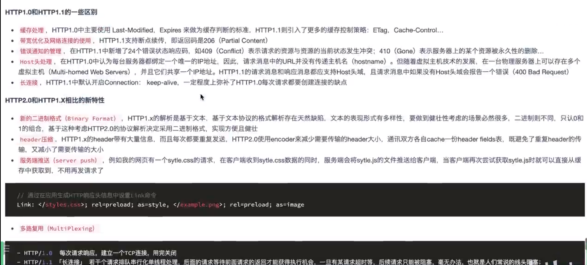


# 补充
> 前端优化 ：
> 1. 尽早尽快的把css下载到客户端（充分利用HTTP多请求多并发机制，chrome一般可以一次发6-7个）
>   - style
>   - link
>   - @import
>   放到顶部  
- 对303的处理则跟原来浏览器对302的处理一样（原来浏览器并没有按照302的要求那样处理），浏览器对307的处理则跟原来302所要求的的一样
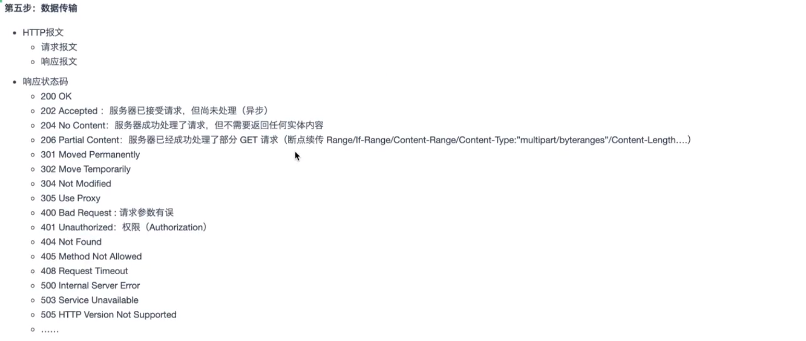